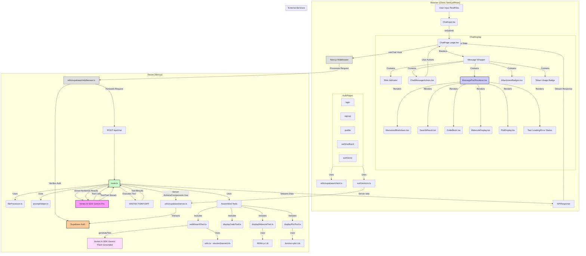

# Plan: Agentic Chat App with Supabase Auth, Tools, File Handling, and Refactored UI

This document describes the current architecture and features of the chat application built using Vercel's AI SDK, Google Vertex AI (Gemini), Next.js with Shadcn UI components, and Supabase for authentication. The application has been refactored for modularity, maintainability, and adherence to SOLID principles.

**Core Features:**

1.  **AI Chat:** Leverages Gemini Pro via `@ai-sdk/google-vertex` for conversational AI.
2.  **Tool Usage:** Supports AI-driven tools:
    *   `webSearch`: Uses a grounded Gemini Flash model to search the web, resolve source URLs, and return structured results (context, sources). (Ref: `src/lib/tools/webSearchTool.ts`)
    *   `displayCode`: Allows the AI to request formatted code block rendering in the UI. (Ref: `src/lib/tools/displayCodeTool.ts`)
    *   `displayMolecule`: Renders 2D chemical structures from SMILES strings using RDKit.js. (Ref: `src/lib/tools/displayMoleculeTool.ts`)
    *   `displayPlot`: Renders 2D plots of mathematical functions using the `function-plot` library. (Ref: `src/lib/tools/displayPlotTool.ts`)
3.  **File Handling:** Users can attach files (images, text) via the chat input, which are processed by the backend and sent to the model. Attachments are visually indicated by badges on user messages.
4.  **Chat Modes:** Supports different chat modes (defined in `src/config/chat-modes.ts`) that modify the system prompt sent to the AI.
5.  **Message Lifecycle:**
    *   **Display:** Renders messages with dedicated components for text, tool invocations (including loading/error states), and attachments.
    *   **Actions:** Provides actions on messages (hover): Edit (user), Copy (user/assistant), Regenerate (assistant).
    *   **Token Usage:** Displays token count for completed assistant messages.

**Authentication & Authorization (Supabase):**

1.  **Integration:** Uses Supabase for user authentication, leveraging the `@supabase/ssr` package for server-side rendering and session management in Next.js.
2.  **Client-Side:** `src/utils/supabase/client.ts` provides a Supabase client instance for use in browser components (e.g., login/signup forms, profile page).
3.  **Server-Side:** `src/utils/supabase/server.ts` provides a Supabase client instance for use in Server Components and Server Actions, handling cookie management appropriately.
4.  **Middleware:** `src/middleware.ts` uses `src/utils/supabase/middleware.ts` to:
    *   Refresh user sessions on incoming requests using `createServerClient`.
    *   Protect routes by checking for an authenticated user (`supabase.auth.getUser()`).
    *   Redirect unauthenticated users attempting to access protected pages (e.g., `/chat`, `/profile`) to the `/login` page. Public pages (e.g., `/`, `/pricing`, `/login`, `/signup`) remain accessible.
5.  **Configuration:** Relies on environment variables `NEXT_PUBLIC_SUPABASE_URL` and `NEXT_PUBLIC_SUPABASE_ANON_KEY`.

**Refactored UI:**

The frontend (`src/app/chat/page.tsx`, `/login`, `/signup`, etc.) is structured with distinct components for better separation of concerns:

*   **Chat Interface:**
    *   `ChatInput`: Handles user text input and file attachments.
    *   `ChatMessageActions`: Renders action buttons (Edit, Copy, Regenerate).
    *   `MessagePartRenderer`: Handles rendering of different message content types (text, tool invocations).
    *   `AttachmentBadges`: Displays badges for file attachments on user messages.
    *   `MoleculeDisplay`: Renders 2D molecule structures requested by the `displayMolecule` tool.
    *   `PlotDisplay`: Renders 2D function plots requested by the `displayPlot` tool.
    *   `SearchResult`: Displays results from the `webSearch` tool.
    *   `CodeBlock`: Renders formatted code requested by the `displayCode` tool.
*   **Authentication:**
    *   `LoginForm`: Handles user login.
    *   `SignupForm`: Handles user registration.
    *   `SignOutButton`: Allows users to log out.
    *   Auth-related pages: `/login`, `/signup`, `/auth/callback`, `/auth/error`.
*   **User Profile:**
    *   `/profile`: Page displaying user information (accessible only when logged in).
*   **Shared Components:** Uses Shadcn UI components (`src/components/ui/`) extensively.

**Refactored Backend:**

1.  **Chat API (`src/app/api/chat/route.ts`):** Acts as an orchestrator:
    *   Uses `fileProcessor.ts` to handle incoming files.
    *   Uses `promptHelper.ts` to build the system prompt based on active modes.
    *   Imports and provides tool definitions (`webSearchTool.ts`, `displayCodeTool.ts`, `displayMoleculeTool.ts`, `displayPlotTool.ts`) to the AI SDK.
    *   Streams responses (text, tool calls/results) back to the client.
2.  **Authentication Actions (`src/app/auth/actions.ts`):** Contains Server Actions for handling login, signup, and signout logic using the server-side Supabase client.
3.  **Utilities:** Includes helper functions for class name merging (`cn`), filename truncation, citation formatting (basic), URL resolution, and Supabase client creation.

**Architecture Diagram (Updated):**



**Request Lifecycles (Sequence Diagrams):**

These diagrams illustrate the flow of requests for key application features.

*   **Chat API Lifecycle**
    ```mermaid
    sequenceDiagram
    participant Client as Browser
    participant Middleware as Next.js
    participant SupaMiddleware as utils/supabase/middleware.ts
    participant SupaAuth as Supabase Auth
    participant ChatAPI as api/chat/route.ts
    participant FileProcessor as lib/api/fileProcessor.ts
    participant PromptHelper as lib/api/promptHelper.ts
    participant VertexAI as Gemini Pro
    participant Tools as webSearch, displayCode, etc.
    participant VertexFlash as Gemini Flash

    Client->>Middleware: POST api/chat (with message, files, modes)
    Middleware->>SupaMiddleware: Process Request
    SupaMiddleware->>SupaAuth: Verify/Refresh Session
    SupaAuth-->>SupaMiddleware: Session Info / OK
    SupaMiddleware->>ChatAPI: Forward Request
    ChatAPI->>FileProcessor: Process Attached Files (if any)
    FileProcessor-->>ChatAPI: Processed File Data
    ChatAPI->>PromptHelper: Build System Prompt (with modes)
    PromptHelper-->>ChatAPI: System Prompt
    ChatAPI->>VertexAI: streamText (prompt, message, files, tools)
    VertexAI-->>ChatAPI: Stream Text Response / Tool Call Request
    alt Text Response
        ChatAPI-->>Client: Stream Text Chunks
    else Tool Call (e.g., webSearch)
        ChatAPI->>Tools: Execute webSearchTool
        Tools->>VertexFlash: generateText (grounded search)
        VertexFlash-->>Tools: Search Results
        Tools-->>ChatAPI: Formatted Tool Result
        ChatAPI->>VertexAI: Send Tool Result
        VertexAI-->>ChatAPI: Stream Further Text Response
        ChatAPI-->>Client: Stream Text Chunks
    end
    ```

*   **User Login Lifecycle**
    ```mermaid
    sequenceDiagram
        participant Client (Browser)
        participant LoginPage (/login)
        participant AuthActions (auth/actions.ts)
        participant SupaServerUtils (utils/supabase/server.ts)
        participant SupaAuth (Supabase Auth)

        Client->>LoginPage: Enters Email/Password, Clicks Login
        LoginPage->>AuthActions: Call login Server Action (formData)
        AuthActions->>SupaServerUtils: createClient()
        SupaServerUtils-->>AuthActions: Supabase Server Client
        AuthActions->>SupaAuth: signInWithPassword(email, password)
        SupaAuth-->>AuthActions: Auth Response (User/Session or Error)
        alt Login Success
            AuthActions->>Client: Redirect to /chat (or intended page)
        else Login Error
            AuthActions->>Client: Redirect back to /login?message=Error
        end
    ```

*   **User Signup Lifecycle**
    ```mermaid
    sequenceDiagram
        participant Client (Browser)
        participant SignupPage (/signup)
        participant AuthActions (auth/actions.ts)
        participant SupaServerUtils (utils/supabase/server.ts)
        participant SupaAuth (Supabase Auth)

        Client->>SignupPage: Enters Email/Password, Clicks Signup
        SignupPage->>AuthActions: Call signup Server Action (formData)
        AuthActions->>SupaServerUtils: createClient()
        SupaServerUtils-->>AuthActions: Supabase Server Client
        AuthActions->>SupaAuth: signUp(email, password)
        SupaAuth-->>AuthActions: Signup Response (User or Error)
        alt Signup Success
            AuthActions->>Client: Redirect to /login?message=Check email
        else Signup Error
            AuthActions->>Client: Redirect back to /signup?message=Error
        end
    ```

*   **Authenticated Page Load Lifecycle (e.g., /chat)**
    ```mermaid
    sequenceDiagram
        participant Client (Browser)
        participant Middleware (Next.js)
        participant SupaMiddleware (utils/supabase/middleware.ts)
        participant SupaAuth (Supabase Auth)
        participant ServerComponent (/chat/page.tsx)
        participant SupaServerUtils (utils/supabase/server.ts)

        Client->>Middleware: GET /chat
        Middleware->>SupaMiddleware: Process Request
        SupaMiddleware->>SupaAuth: Verify/Refresh Session (getUser)
        SupaAuth-->>SupaMiddleware: User Session Info
        alt User Authenticated
            SupaMiddleware->>ServerComponent: Render Page
            ServerComponent->>SupaServerUtils: createClient() (if needed for data fetching)
            SupaServerUtils-->>ServerComponent: Supabase Server Client
            ServerComponent->>SupaAuth: Fetch User Data (if needed)
            SupaAuth-->>ServerComponent: User Data
            ServerComponent-->>Client: Render Page Content
        else User Not Authenticated
            SupaMiddleware->>Client: Redirect to /login
        end
    ```

**Roadmap:**

*   *(Placeholder: Add planned features or improvements here)*

**Potential Future Features:**

*   *(Placeholder: Add longer-term ideas or explorations here)*
*   More sophisticated tool error handling and reporting to the user.
*   User settings persistence (e.g., selected chat modes).
*   Chat history saving and retrieval (requires database integration beyond auth).
*   Integration with other data sources or APIs via new tools.
*   Enhanced file type support (e.g., PDFs, structured data files).
